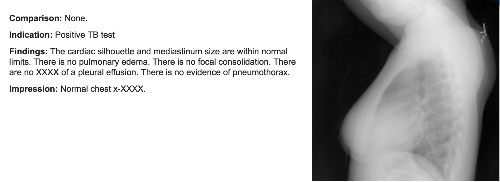
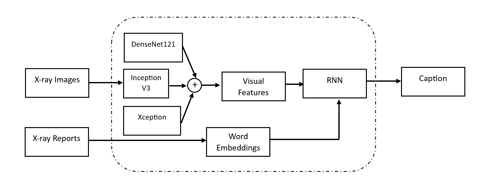

# A Multi-Visual Feature Extraction model for X-Ray interpretation

This paper presents a deep learning approach for extracting visual features to generate report summaries from X-ray images. This is a comparative study of the models trained on the Indiana University - Chest X-Rays dataset and evaluated
against BLEU, METOR, and ROUGE scores. In this project, we have conducted in-depth literature reviews and proposed a Multi-Visual Feature Extraction model, geared towards optimizing the interpretation of Chest X-ray images.

Below is the basic encoding and decoding architecture of the traditionl model.

This approach uses only a single CNN model for feature extraction.  Initially, the input consists of X-ray images which are processed through a
Convolutional Neural Network (CNN) architecture for the
extraction of visual features. This part of the model uses
popular methods like DenseNet121, InceptionV3, and Xception for feature generation. This feature tensor serves as the
precursor for the subsequent Recurrent Neural Network (RNN)
processing stage.
Concurrently, textual data extracted from medical reports
undergo a transformation into word embeddings. For data
preparation, we tokenized all the words in the findings and
impression in the dataset and obtained 2,218 unique words.
Considering that the c size is already very small, we decided
not to drop infrequent words with only once or twice appearances. We also added two special tokens, ¡start¿ and ¡end¿,
into the vocabulary to indicate the start and the end of a
sentence. To evaluate our models, we randomly picked 250
reports to form the testing set. All evaluations are done on
the testing set.This process is crucial as it converts raw text
into a format that is amenable to deep learning algorithms.
The synergy between these word embeddings and the RNN
module is pivotal for the accurate generation of outputs.

We propose a novel
approach that combines three diverse visual feature generators
(DenseNet121, InceptionV3, and Xception) shown below.
By using these different methods together, our model can learn
more details and pick up on things that might be missed by
using just one method. This should make the model more
effective at understanding both the images and the reports.

In our comparative analysis, distinct performance trends emerged among the evaluated methods as shown in below table. The Vanilla CNN-RNN method serves as a baseline model in the context of our study. Surprisingly, our proposed method, the Multi-Encoder-Decoder, recorded uniform scores of 0.1 across all metrics. This uniformity and significantly lower performance as compared to other methods raise concerns about the efficacy of this approach or possible limitations in our implementation. Further investigation and refinement are necessary to understand and address these shortcomings.

